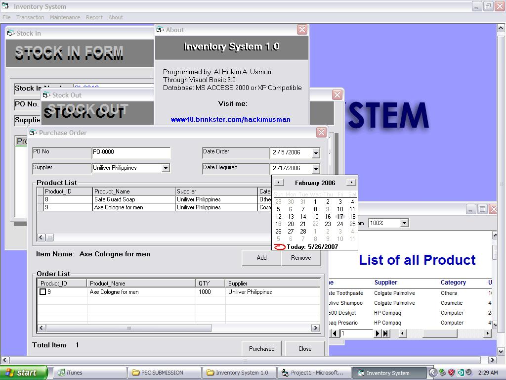



## A Inventory System 1\.0

### Description

Manage and process purchase order, stock in, stock out, product quantity and profile and users.

It also shows reports of status of the products that are encoded in the database.
 
### More Info
 
Inputs are products's attribute such as ProductID, ProductName, Category, Supplier etc...

Processed Stock quantity and profiles

             |
---                |---
**Submitted On**   |2007-05-26 02:11:30
**By**             |[Al\-Hakim A\. Usman](https://github.com/Planet-Source-Code/PSCIndex/blob/master/ByAuthor/al-hakim-a-usman.md)
**Level**          |Intermediate
**User Rating**    |4.1 (49 globes from 12 users)
**Compatibility**  |VB 6\.0
**Category**       |[Complete Applications](https://github.com/Planet-Source-Code/PSCIndex/blob/master/ByCategory/complete-applications__1-27.md)
**World**          |[Visual Basic](https://github.com/Planet-Source-Code/PSCIndex/blob/master/ByWorld/visual-basic.md)
**Archive File**   |[Inventory\_2067645272007\.zip](https://github.com/Planet-Source-Code/al-hakim-a-usman-a-inventory-system-1-0__1-68680/archive/master.zip)

